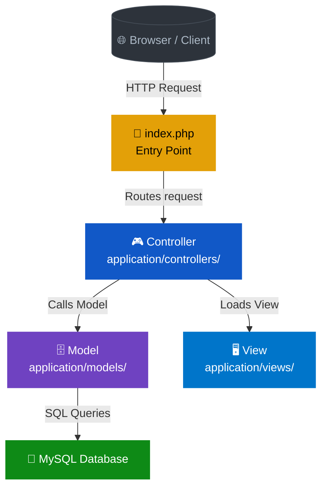

# CodeIgniter 3 — PHP MVC Internship Project

> PHP backend development using **CodeIgniter 3 · MySQL · MVC Architecture** — CRUD operations, dynamic data rendering, and modular code structure built during internship

<br>

<div align="center">

| | Highlights |
|:---:|:---:|
| **Framework** | CodeIgniter 3 (PHP) |
| **Architecture** | MVC (Model · View · Controller) |
| **Database** | MySQL |
| **Key Skills** | CRUD · Dynamic Rendering · Backend Logic |
| **Result** | ✅ Functional modules delivered during internship |

</div>

---

## 🏗️ Overall Architecture



---

## 📁 Project — CodeIgniter 3 CRUD Modules (Internship)

**Developed functional backend modules using CodeIgniter 3's MVC pattern during internship — implementing complete CRUD operations with MySQL database integration.**

<br>

### 🔧 Tools Used


<br>

### MVC Request Flow


<br>

### Step-by-Step Breakdown

**① MVC Structure — Organized Codebase**
CodeIgniter 3 ka MVC pattern follow kiya — Controllers mein business logic, Models mein database queries, aur Views mein HTML rendering. Clean separation of concerns maintain ki.

**② CRUD Operations — Full Backend Logic**
Create, Read, Update, Delete — saare operations implement kiye. Form submissions se data insert hota tha, list pages pe dynamic fetch, edit forms pre-filled, aur soft/hard delete functionality.

**③ MySQL Integration — Dynamic Data**
MySQL database se live data fetch karke views mein dynamically display kiya. Query Builder class use ki for secure, injection-safe DB operations.

**④ Routing & URL Structure**
CI3 ka `routes.php` configure kiya. Clean URLs banaye — `controller/method/param` structure follow kiya, `index.php` URL se remove kiya `.htaccess` se.

**⑤ Form Validation & Security**
CI3 ka built-in Form Validation library use kiya — server-side validation rules define ki. XSS filtering aur CSRF protection enable ki application config mein.

<br>

### Folder Structure

```
CodeIgnitier-3-/
│
├── application/
│   ├── controllers/     # Business logic — request handling
│   ├── models/          # Database queries — MySQL interaction
│   ├── views/           # HTML templates — dynamic rendering
│   └── config/
│       ├── database.php # DB connection config
│       └── routes.php   # URL routing rules
│
├── assets/              # CSS, JS, images
├── system/              # CI3 core (do not modify)
├── .htaccess            # Remove index.php from URL
└── index.php            # Application entry point
```

<br>

### Sample Code — Controller

```php
<?php
defined('BASEPATH') OR exit('No direct script access allowed');

class Items extends CI_Controller {

    public function __construct() {
        parent::__construct();
        $this->load->model('Item_model');
        $this->load->library(['form_validation', 'session']);
        $this->load->helper(['url', 'form']);
    }

    // READ — list all items
    public function index() {
        $data['items'] = $this->Item_model->get_all();
        $this->load->view('items/index', $data);
    }

    // CREATE — insert new item
    public function create() {
        $this->form_validation->set_rules('name', 'Name', 'required|trim');
        if ($this->form_validation->run() == FALSE) {
            $this->load->view('items/create');
        } else {
            $this->Item_model->insert([
                'name' => $this->input->post('name')
            ]);
            redirect('items');
        }
    }

    // UPDATE — edit existing item
    public function edit($id) {
        $data['item'] = $this->Item_model->get_by_id($id);
        $this->load->view('items/edit', $data);
    }

    // DELETE — remove item
    public function delete($id) {
        $this->Item_model->delete($id);
        redirect('items');
    }
}
```

### Sample Code — Model

```php
<?php
class Item_model extends CI_Model {

    protected $table = 'items';

    public function get_all() {
        return $this->db->get($this->table)->result_array();
    }

    public function get_by_id($id) {
        return $this->db->get_where($this->table, ['id' => $id])->row_array();
    }

    public function insert($data) {
        return $this->db->insert($this->table, $data);
    }

    public function update($id, $data) {
        $this->db->where('id', $id);
        return $this->db->update($this->table, $data);
    }

    public function delete($id) {
        $this->db->where('id', $id);
        return $this->db->delete($this->table);
    }
}
```

### Sample Code — View (index.php)

```php
<!-- application/views/items/index.php -->
<h2>All Items</h2>
<a href="<?= site_url('items/create') ?>">+ Add New</a>

<table border="1" cellpadding="8">
    <tr>
        <th>ID</th>
        <th>Name</th>
        <th>Actions</th>
    </tr>
    <?php foreach ($items as $item): ?>
    <tr>
        <td><?= $item['id'] ?></td>
        <td><?= htmlspecialchars($item['name']) ?></td>
        <td>
            <a href="<?= site_url('items/edit/' . $item['id']) ?>">Edit</a> |
            <a href="<?= site_url('items/delete/' . $item['id']) ?>"
               onclick="return confirm('Delete?')">Delete</a>
        </td>
    </tr>
    <?php endforeach; ?>
</table>
```

<br>

### Database Config

```php
// application/config/database.php
$db['default'] = array(
    'dsn'      => '',
    'hostname' => 'localhost',
    'username' => 'root',
    'password' => '',
    'database' => 'your_database_name',
    'dbdriver' => 'mysqli',
    'dbprefix' => '',
    'pconnect' => FALSE,
    'db_debug' => (ENVIRONMENT !== 'production'),
    'cache_on' => FALSE,
    'char_set' => 'utf8',
    'dbcollat' => 'utf8_general_ci',
);
```

<br>

> [!TIP]
> ✅ **Result** — Functional CRUD modules built during internship · MySQL dynamic data integration · MVC separation maintained · Form validation & XSS filtering applied · Clean URL routing via `.htaccess`

---

## ⚙️ Complete Tech Stack

| Category | Tools |
|---|---|
| Backend Framework |  PHP MVC · Query Builder |
| Database |  CRUD · Dynamic Queries |
| Frontend |   |
| Language |  |
| Version Control |   |
| IDE |  |
| Web Server | Apache · `.htaccess` URL rewriting |

---

## 🚀 How to Run Locally

```bash
# 1. Clone the repository
git clone https://github.com/PushpenderKumar7505/CodeIgnitier-3-.git
cd CodeIgnitier-3-

# 2. Place in your server root (XAMPP/WAMP)
# e.g., C:/xampp/htdocs/CodeIgnitier-3-

# 3. Create MySQL database and import your SQL file
# Update: application/config/database.php with your DB credentials

# 4. Start Apache + MySQL from XAMPP Control Panel

# 5. Open in browser
http://localhost/CodeIgnitier-3-/
```

<br>

> [!NOTE]
> Make sure Apache `mod_rewrite` is enabled and `AllowOverride All` is set in your Apache config for `.htaccess` URL rewriting to work.

---

## 🎯 Key Learnings from Internship

| Skill | What I Learned |
|---|---|
| MVC Pattern | Separation of concerns — Controller, Model, View |
| CRUD Operations | Full create/read/update/delete backend logic |
| MySQL Integration | Dynamic data fetch & display via Query Builder |
| Form Validation | Server-side rules, XSS filtering, CSRF protection |
| URL Routing | Clean URL configuration via `routes.php` + `.htaccess` |
| PHP Best Practices | Modular code, reusable models, maintainable structure |

---

## 👨‍💻 Author

**Pushpender Kumar** — B.Tech CSE, GLA University 2024

[](https://linkedin.com/in/pushpender-kumar-5280b7226)
[](https://github.com/PushpenderKumar7505)
[](mailto:pushpender7505@gmail.com)
